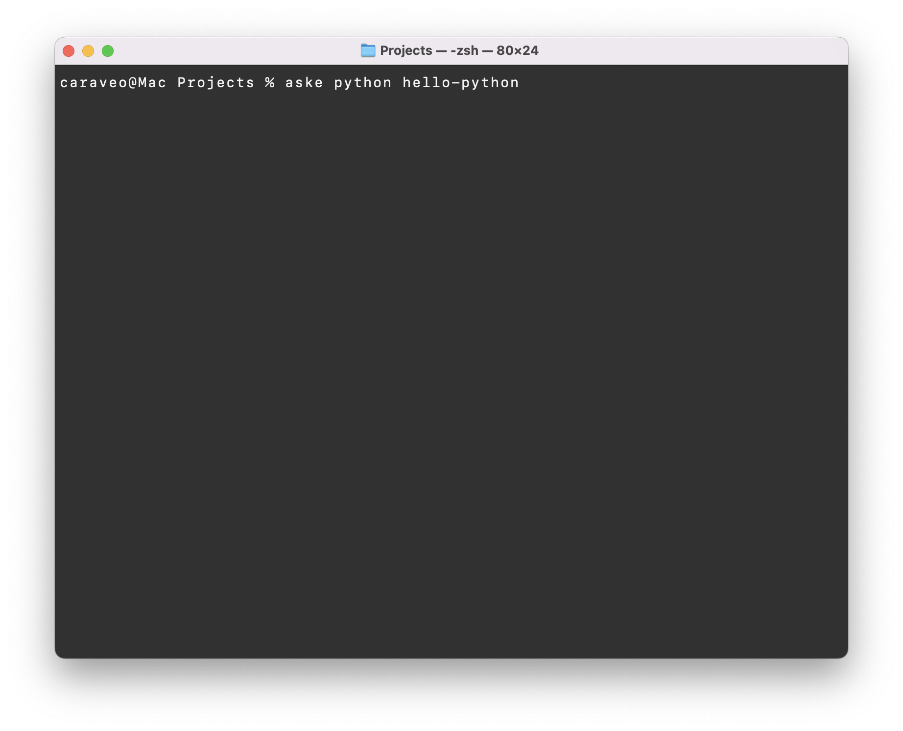

# ASKE - Automated Starter Kit Ecosystem

**ASKE** is opinionated. It knows what it wants: **scale**, **growth**, **prosperity**. It makes choices for you while still giving you the option to **override** them.

Answer the question: **“Aske what?”** Consider it philosophically. What can you do with ASKE? Startup or crash, scale or bust; create the next Node.js masterpiece or the Python framework that will change the world. It’s a launching point for all things—it helps you hit the ground running… no, flying! Whether it’s Node.js with Express or Next.js, Python with venv and a starter app, Ruby with Rails, Java with Spring Boot, PHP with Laravel, or Go with Gin, Echo, Fiber, Chi, Buffalo, or Revel, ASKE has you covered.

ASKE is not merely a tool; it’s a bold invitation to defy the mundane. With each command, you choose between the promise of rapid innovation or the risk of failure. The decision is yours: embark on a startup journey or face the challenge head-on, scaling new heights or confronting brute reality.

In essence, ASKE compels you to embrace both the speed and precision required to build the future. It guides you into a realm of strict best practices, whipping your project into shape while inspiring limitless creativity. So, ask yourself: with ASKE, will you soar beyond the ordinary, or simply crash into mediocrity?

It’s almost a meme now—“Launch all the frameworks!”—a rallying cry for developers who dare to dream big and build even bigger.

## Overview

ASKE is an opinionated command-line tool designed to simplify and accelerate the process of initializing and managing development projects. By being opinionated, ASKE makes specific technology choices to fast-track framework creation:

- Python: Uses venv for virtual environments
- Ruby: Uses Rails with rbenv
- Java: Uses Spring Boot with Maven
- Node.js: Uses Express.js or Next.js
- Database: Defaults to PostgreSQL where applicable
- PHP: Uses Laravel with Composer
- Go: Uses Gin, Echo, Fiber, Chi, Buffalo, or Revel

> **Note:** Currently, ASKE is optimized for macOS environments, particularly those running on Apple Silicon. Future versions will aim to provide better cross-platform support and modularity.

## Why ASKE?

In modern development, setting up a new project can be time-consuming with manual steps for configuration and environment setup. ASKE was created to:

- **Automate Repetitive Tasks:** Quickly initialize a new project with a standardized structure.
- **Boost Productivity:** Reduce setup time so you can concentrate on development.
- **Enforce Best Practices:** Make opinionated choices that follow industry standards.

## Current Target Audience

- **Platform Support:** Primary focus on macOS/Apple Silicon
- **Package Managers:** Uses Homebrew for system dependencies
- **Fixed Choices:** Limited flexibility in technology selection
- **Environment Management:** Specific choices (venv, rbenv, etc.)

## Future Plans

We plan to make ASKE more modular and flexible in future releases:
- Support for multiple operating systems
- Configurable technology choices
- Alternative package manager support
- Pluggable architecture for custom pipelines

## Installation

### Using pip

Install ASKE globally via pip:

```pip install aske```

### Using Homebrew

Alternatively, if you prefer Homebrew (note that the Homebrew formula is pending integration into the official Homebrew-core):

```brew tap caraveo/aske && brew install aske```

### Usage

To create a new Python project, use the following command:

```aske python project-name```

[](https://youtu.be/oPxNfZsv1z8)


### This command will:
	- Create a new project directory named project-name.
	- Set up a Python virtual environment inside the directory.
	- Generate essential project files (e.g., requirements.txt, .env, and a starter app.py).
	- Provide a starting point for your project with a basic Python application.


Available commands:

```aske node project-name```

```aske next project-name```

```aske express project-name```

```aske ruby project-name```

```aske java project-name```

```aske php project-name```

```aske go project-name --framework=gin|echo|fiber|chi|buffalo|revel```

Initialize a projects git repository and add a .gitignore file:

```aske init```

## Aske Workflow Pipeline

Below is a set of detailed instructions for how to use ASKE’s workflow effectively, particularly on macOS Apple Silicon:

Initial Command Execution:

```aske <template> <project>```

This command initializes the project using the specified template (e.g., python, node, PHP, etc.) and creates the project directory with a standard structure.

## Continuous Pipeline Execution

The workflow is designed to be **iterative**. Once the command is executed, ASKE will continually monitor the installation status of the framework dependencies.

If the required dependencies are missing or outdated, you will need to re-run the command.

This pipeline loop continues until the pipeline detects that all required components for the specified framework are properly installed.

	
## Dependency Checks and Guidance

ASKE performs automated checks to verify if essential dependencies (like the proper version of Java, PHP, Node, or other framework-specific tools) are installed on your system.

For macOS Apple Silicon users, if any dependency is missing, ASKE will provide clear, step-by-step instructions to install it.
	
For instance, it might suggest installing dependencies via Homebrew:

```brew install <dependency>```

And if needed, guide you through using environment managers to handle multiple versions.

## Guided Installation Process
Throughout the execution of the pipeline, if the system identifies that a required dependency isn’t installed, it will:

Prompt the user with a message indicating the missing dependency.

Offer direct guidance or commands that can be executed to install the missing dependency specifically optimized for macOS Apple Silicon.

Wait for confirmation or automatic detection of the dependency installation before proceeding further.
	
## Final Outcome:
Once all dependency checks are passed and the necessary frameworks are successfully installed, ASKE will finalize the project setup. At this point, you will have a fully configured project environment, ready for development with the chosen framework.
	
These instructions outline the ideal usage of the ASKE workflow, emphasizing continuous dependency checking and guided installations tailored for macOS Apple Silicon users.

These additions will make ASKE a versatile initializer for a wide range of development environments.

## Contributing

Contributions are welcome! If you have ideas for improvements or additional features, please fork the repository and submit a pull request. For major changes, feel free to open an issue first to discuss your ideas.

## License

ASKE is released under the MIT License. See the LICENSE file for more details.
